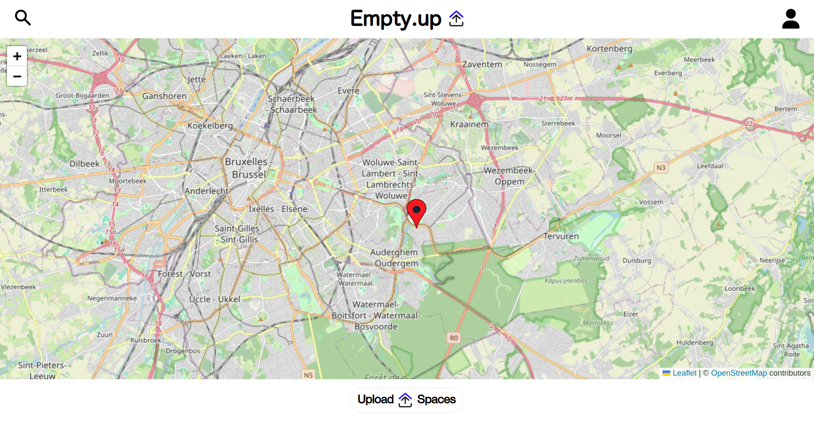

# EmptyUp (Work in Progress)

## Status
Work in progress 

## Screenshots

## Description 
EmptyUp is an application designed to showcase vacant buildings within a city. It relies on a community of users who contribute by uploading information about empty buildings to the platform.  

The platform features a map that displays buildings uploaded by users, whether they have an account or not.   
An authentication system provides users with access to a profile, allowing them to:
- Upload building information.
- Comment on buildings to update details.
- Like buildings and create a personal list of liked/registered buildings.
- Post or view ads related to buildings.
- Connect with other users who have commented on a building or posted an ad. 

A search system enables users to filter buildings based on:
- The city of the building.
- The type of the building.
- The date of upload.
- The most commented.
- The most liked.

## Dependencies

### Frontend
- Tailwind
- Axios
- React 
- React-bootstrap
- React-calendar
- React-cookie
- React-dom
- React-hook-form
- React-leaflet
- React-scripts
- Uuid
- Uuidv4
- Web-vitals
- Post-cli
- @fortawesome/fontawesome-svg-core
- @fortawesome/free-solid-icons
- @fortawesome/react-fontawesome
- @testing-library/jest-dom
- @testing-library/react
- @testing-library/user-event

### Backend
- Node.js
- Postgresql
- Express
- Body-parser
- Express-fileupload
- Bcrypt
- Jsonwebtoken
- Cloudinary
- Dotenv
- Nodemon
- Pg
